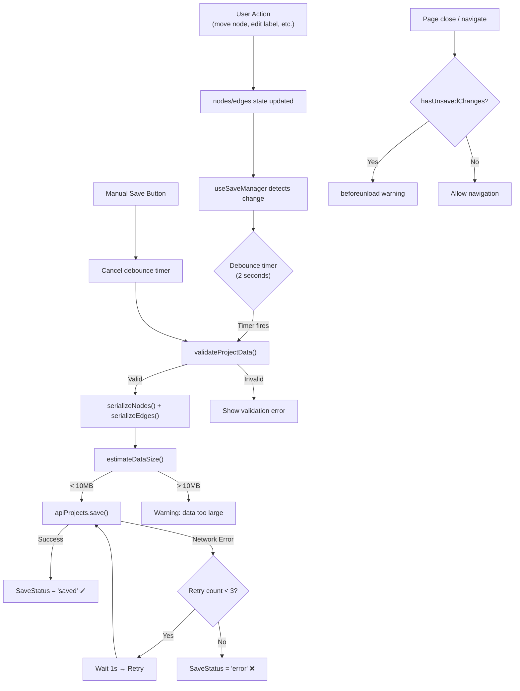

# إعادة هيكلة نظام حفظ المشاريع و Canvas Nodes في Flow

## ملخص المشكلة الحالية

بعد فحص شامل للمشروع، اكتشفت عدة مشاكل هيكلية خطيرة في نظام الحفظ الحالي:

> [!CAUTION]
> ### المشاكل الحرجة المكتشفة
> 1. **ملف App.tsx عملاق (1646 سطر)** — كل المنطق في ملف واحد مما يسبب صعوبة الصيانة وأخطاء غير متوقعة
> 2. **عدم وجود Validation للبيانات** — البيانات تُرسل للسيرفر بدون تحقق كامل
> 3. **Serialization غير آمن** — `serializeNodes` يحذف `icon` لكن لا يتعامل مع `imageUrl` الكبيرة (Base64) التي قد تسبب فشل الحفظ
> 4. **Race Conditions في Auto-Save** — الـ debounced auto-save قد يتداخل مع manual save
> 5. **فقدان البيانات عند التنقل** — لا يوجد حماية من الخروج قبل الحفظ
> 6. **عدم التعامل مع حجم البيانات** — `LONGTEXT` في MySQL لكن Base64 للصور/الفيديو قد تتجاوز الحد
> 7. **State management ضعيف** — Projects state تُدار من DesktopOnly وتُمرر عبر props بشكل معقد
> 8. **لا يوجد Optimistic Updates** — المستخدم لا يرى تغييرات فورية
> 9. **generateFlow غير مستورد** — الدالة مستخدمة في السطر 812 لكن لم يتم استيرادها!

## Open Questions

> [!IMPORTANT]
> 1. **هل تريد الاحتفاظ بالصور/الفيديو كـ Base64 في قاعدة البيانات أم ترفعها كملفات منفصلة؟** — Base64 يمكن أن يسبب بطء شديد مع المشاريع الكبيرة
> 2. **هل تريد دعم Undo/Redo؟** — سيؤثر على هيكلة الـ state management
> 3. **هل الـ Backend سيبقى PHP/XAMPP أم تخطط للانتقال؟** — سيؤثر على بعض قرارات التصميم

---

## Proposed Changes

### 1. طبقة الأنواع (Types Layer) — الأساس

#### [NEW] [types/project.ts](file:///c:/Users/nordi/Downloads/mediatower-main/mediatower-main/src/types/project.ts)

ملف تعريف الأنواع المركزي — كل الملفات ستستورد منه:

```typescript
// ===== Node Data Types =====
export interface FlowNodeData {
  label: string;
  subLabel?: string;
  variant: 'wireframe' | 'shape' | 'social' | 'text' | 'image' | 'video' | 'video_upload' | 'notepad';
  color?: string;
  url?: string;
  shape?: 'circle' | 'diamond' | 'rectangle' | 'triangle' | 'round-rectangle';
  imageUrl?: string;
  videoUrl?: string;
  icon?: React.ComponentType<any>; // non-serializable — restored on load
}

// ===== Serialized (safe for JSON/DB) =====
export interface SerializedNodeData {
  label: string;
  subLabel?: string;
  variant: string;
  color?: string;
  url?: string;
  shape?: string;
  imageUrl?: string;
  videoUrl?: string;
}

export interface SerializedNode {
  id: string;
  type: string;
  position: { x: number; y: number };
  data: SerializedNodeData;
  style?: Record<string, any>;
  measured?: { width: number; height: number };
}

export interface SerializedEdge {
  id: string;
  source: string;
  target: string;
  sourceHandle?: string;
  targetHandle?: string;
  label?: string;
  animated?: boolean;
  style?: Record<string, any>;
  type?: string;
  data?: Record<string, any>;
}

// ===== Project =====
export interface Project {
  id: string;
  name: string;
  lastModified: number;
  data: {
    nodes: SerializedNode[];
    edges: SerializedEdge[];
  } | null; // null = not loaded yet
}

// ===== Save Status =====
export type SaveStatus = 'idle' | 'unsaved' | 'saving' | 'saved' | 'error';
```

---

### 2. طبقة Serialization الآمنة

#### [NEW] [utils/serialization.ts](file:///c:/Users/nordi/Downloads/mediatower-main/mediatower-main/src/utils/serialization.ts)

تجمع كل منطق التحويل بين Runtime nodes و Serialized nodes:

```typescript
/**
 * serializeNodes — إزالة الحقول غير القابلة للتسلسل (مثل icon)
 * + التحقق من حجم البيانات
 */
export function serializeNodes(nodes: any[]): SerializedNode[]

/**
 * serializeEdges — تنظيف edges مع الحفاظ على الخصائص المهمة
 */
export function serializeEdges(edges: any[]): SerializedEdge[]

/**
 * deserializeNodes — استعادة الـ icons والخصائص بعد التحميل
 */
export function deserializeNodes(nodes: SerializedNode[]): any[]

/**
 * validateProjectData — التحقق من سلامة البيانات قبل الحفظ
 */
export function validateProjectData(nodes: SerializedNode[], edges: SerializedEdge[]): { valid: boolean; errors: string[] }

/**
 * estimateDataSize — تقدير حجم البيانات لمنع تجاوز حدود الخادم
 */
export function estimateDataSize(nodes: SerializedNode[], edges: SerializedEdge[]): number
```

**لماذا هذا مهم؟** حالياً `serializeNodes` في App.tsx (سطر 1247) تحذف `icon` لكن:
- لا تتعامل مع الحقول الزائدة التي يضيفها ReactFlow (مثل `measured`, `internals`)
- لا تتحقق من حجم `imageUrl` (Base64 قد يكون عدة ميغابايت)
- لا تتحقق من Edge references — edge يشير لـ node محذوف = خطأ عند التحميل

---

### 3. طبقة إدارة الحفظ (Save Manager)

#### [NEW] [hooks/useSaveManager.ts](file:///c:/Users/nordi/Downloads/mediatower-main/mediatower-main/src/hooks/useSaveManager.ts)

Hook مخصص يجمع كل منطق الحفظ في مكان واحد:

```typescript
interface UseSaveManagerOptions {
  projectId: string;
  projectName: string;
  nodes: any[];
  edges: any[];
  onSave: (id: string, name: string, nodes: any[], edges: any[]) => Promise<void>;
  debounceMs?: number;      // default 2000
  maxRetries?: number;       // default 3
}

interface UseSaveManagerReturn {
  saveStatus: SaveStatus;
  lastSavedAt: number | null;
  manualSave: () => Promise<void>;
  hasUnsavedChanges: boolean;
  error: string | null;
}
```

**المزايا الجديدة:**
- ✅ **Retry Logic** — إعادة المحاولة 3 مرات عند فشل الحفظ
- ✅ **Conflict Prevention** — منع manual save و auto-save من التداخل
- ✅ **beforeunload Protection** — تحذير المستخدم من إغلاق الصفحة قبل الحفظ
- ✅ **Save Queue** — ضمان ترتيب عمليات الحفظ (لا يتم حفظ نسخة قديمة بعد جديدة)
- ✅ **Size Check** — تحذير إذا كان حجم البيانات كبير جداً

---

### 4. طبقة إدارة المشاريع (Projects Manager)

#### [NEW] [hooks/useProjectsManager.ts](file:///c:/Users/nordi/Downloads/mediatower-main/mediatower-main/src/hooks/useProjectsManager.ts)

يجمع كل منطق CRUD للمشاريع:

```typescript
interface UseProjectsManagerReturn {
  projects: Project[];
  isLoading: boolean;
  error: string | null;
  
  createProject: () => Promise<Project>;
  openProject: (id: string) => Promise<Project>;
  saveProject: (id: string, name: string, nodes: any[], edges: any[]) => Promise<void>;
  deleteProject: (id: string) => Promise<void>;
  refreshProjects: () => Promise<void>;
}
```

---

### 5. تقسيم App.tsx إلى مكونات

> [!WARNING]
> هذا أكبر تغيير — سنقسم ملف 1646 سطر إلى ملفات منفصلة. **لن نغير أي سلوك مرئي**، فقط نعيد التنظيم.

#### [MODIFY] [App.tsx](file:///c:/Users/nordi/Downloads/mediatower-main/mediatower-main/src/App.tsx)
- سيبقى فيه فقط: `App`, `DesktopOnly`, `FlowEditorRoute`, `AuthScreen`
- سيتقلص من **1646 سطر** إلى **~400 سطر**

#### [NEW] [components/flow/CustomNode.tsx](file:///c:/Users/nordi/Downloads/mediatower-main/mediatower-main/src/components/flow/CustomNode.tsx)
- مكون `CustomNode` الكامل (السطور 111-443)

#### [NEW] [components/flow/NodeInspector.tsx](file:///c:/Users/nordi/Downloads/mediatower-main/mediatower-main/src/components/flow/NodeInspector.tsx)
- لوحة تحرير الـ Node المحدد (السطور 1042-1180)

#### [NEW] [components/flow/LibraryPanel.tsx](file:///c:/Users/nordi/Downloads/mediatower-main/mediatower-main/src/components/flow/LibraryPanel.tsx)
- مكتبة العناصر (السطور 935-1001)

#### [NEW] [components/flow/FlowEditor.tsx](file:///c:/Users/nordi/Downloads/mediatower-main/mediatower-main/src/components/flow/FlowEditor.tsx)
- مكون `FlowEditor` الرئيسي (السطور 528-1244)
- سيستخدم `useSaveManager` بدلاً من المنطق المبعثر

#### [NEW] [components/flow/FlowToolbar.tsx](file:///c:/Users/nordi/Downloads/mediatower-main/mediatower-main/src/components/flow/FlowToolbar.tsx)
- شريط الأدوات (zoom, prompt, export)

#### [NEW] [constants/libraryItems.ts](file:///c:/Users/nordi/Downloads/mediatower-main/mediatower-main/src/constants/libraryItems.ts)
- `LIBRARY_ITEMS` object (السطور 452-526)
- دالة `findIcon` (السطور 101-107)

---

### 6. تحسين API Client

#### [MODIFY] [services/apiClient.ts](file:///c:/Users/nordi/Downloads/mediatower-main/mediatower-main/src/services/apiClient.ts)

تحسينات:
- إضافة **Retry with exponential backoff**
- إضافة **Request timeout** (30 ثانية)
- تحسين **Error messages** لتكون أوضح
- إضافة **Response size validation**

---

### 7. إصلاح Backend

#### [MODIFY] [myapp/api/projects.php](file:///c:/Users/nordi/Downloads/mediatower-main/mediatower-main/myapp/api/projects.php)

تحسينات:
- إضافة **JSON validation** قبل الحفظ (`json_decode` ثم `json_encode` للتحقق)
- إضافة **Size limit check** (مثلاً 10MB max)
- إرجاع **البيانات المحفوظة** في response بعد PUT لتأكيد الحفظ
- إضافة **`updated_at` timestamp** في response

---

## ملخص هيكلة الملفات الجديدة

```
src/
├── types/
│   └── project.ts              ← [NEW] أنواع مركزية
├── utils/
│   └── serialization.ts        ← [NEW] تحويل + تحقق
├── hooks/
│   ├── useSaveManager.ts       ← [NEW] إدارة الحفظ
│   └── useProjectsManager.ts   ← [NEW] إدارة المشاريع
├── constants/
│   └── libraryItems.ts         ← [NEW] ثوابت المكتبة
├── components/
│   ├── Workspace.tsx            ← [KEEP] بدون تغيير
│   └── flow/
│       ├── CustomNode.tsx       ← [NEW] مكون Node
│       ├── NodeInspector.tsx    ← [NEW] لوحة التحرير
│       ├── LibraryPanel.tsx     ← [NEW] مكتبة العناصر
│       ├── FlowEditor.tsx       ← [NEW] المحرر الرئيسي
│       └── FlowToolbar.tsx      ← [NEW] شريط الأدوات
├── services/
│   ├── apiClient.ts             ← [MODIFY] تحسينات
│   └── geminiService.ts         ← [KEEP] بدون تغيير
├── App.tsx                      ← [MODIFY] تقليص كبير
├── main.tsx                     ← [KEEP]
└── index.css                    ← [KEEP]
```

---

## خريطة تدفق الحفظ الجديد (كيف يعمل)



---

## الأخطاء المتوقعة وكيفية تفاديها

| # | الخطأ المتوقع | السبب | الحل |
|---|---|---|---|
| 1 | **فقدان `icon` بعد الحفظ وإعادة التحميل** | `icon` هو React component لا يمكن تحويله لـ JSON | `deserializeNodes()` يستعيد الـ icon من `findIcon(label)` — **موجود حالياً لكن بحاجة لتعزيز** |
| 2 | **Edge يشير لـ Node محذوف** | حذف node بدون تنظيف edges في بعض السيناريوهات | `validateProjectData()` يكشف ويزيل edges اليتيمة |
| 3 | **فشل الحفظ بسبب حجم Base64** | صورة كبيرة = `imageUrl` ضخم | `estimateDataSize()` يحذر + نقترح ضغط الصور مستقبلاً |
| 4 | **Race condition بين auto-save و manual save** | كلاهما يستدعي API بنفس الوقت | `useSaveManager` يستخدم queue + lock |
| 5 | **فقدان بيانات عند إغلاق الصفحة** | المستخدم يغلق قبل اكتمال debounce | `beforeunload` event + حفظ فوري عند beforeunload |
| 6 | **تكرار ID عند إنشاء nodes** | `Date.now()` قد يتكرر لو أضاف عقدتين بسرعة | استخدام `crypto.randomUUID()` أو `${Date.now()}-${Math.random()}` |
| 7 | **`generateFlow` غير مستورد** | الدالة مستخدمة في السطر 812 لكن لم يتم import | إضافة `import { generateFlow }` |
| 8 | **`measured` property من ReactFlow** | ReactFlow يضيف `measured` للـ nodes تلقائياً — إذا حُفظت وأُعيد تحميلها بدون `measured` قد يتسبب في re-layout | `serializeNodes` يحتفظ بـ `measured` في البيانات المحفوظة |
| 9 | **أخطاء CORS في apiClient** | عند التبديل بين localhost و production | apiClient يتعامل بشكل ذكي مع الـ base URL |
| 10 | **MySQL `max_allowed_packet`** | مشاريع كبيرة تتجاوز حد MySQL | Backend يتحقق من الحجم قبل INSERT/UPDATE |

---

## Verification Plan

### Automated Tests
```bash
# بناء المشروع بدون أخطاء TypeScript
npm run lint

# بناء الإنتاج
npm run build
```

### Manual Verification
1. ✅ إنشاء مشروع جديد → يظهر في القائمة
2. ✅ إضافة nodes من المكتبة (wireframe, shape, social) → تظهر بشكل صحيح
3. ✅ ربط nodes بـ edges → تُحفظ الروابط
4. ✅ تعديل اسم/لون/URL للـ node → يُحفظ تلقائياً
5. ✅ إغلاق المشروع وفتحه مجدداً → كل شيء كما كان (بما فيه icons)
6. ✅ رفع صورة + حفظ + إعادة فتح → الصورة تظهر
7. ✅ حذف node → edges المرتبطة تُحذف
8. ✅ الضغط على Save يدوياً → يعمل بشكل صحيح
9. ✅ فصل الإنترنت أثناء الحفظ → رسالة خطأ واضحة + retry
10. ✅ فتح مشروع مباشرة من URL (direct access) → يعمل

---

## ترتيب التنفيذ (خطوة بخطوة)

1. **إنشاء** `types/project.ts` — الأنواع
2. **إنشاء** `constants/libraryItems.ts` — نقل الثوابت
3. **إنشاء** `utils/serialization.ts` — منطق التحويل والتحقق
4. **إنشاء** `hooks/useSaveManager.ts` — إدارة الحفظ
5. **إنشاء** `hooks/useProjectsManager.ts` — إدارة المشاريع
6. **إنشاء** `components/flow/CustomNode.tsx` — نقل المكون
7. **إنشاء** `components/flow/NodeInspector.tsx` — نقل لوحة التحرير
8. **إنشاء** `components/flow/LibraryPanel.tsx` — نقل المكتبة
9. **إنشاء** `components/flow/FlowToolbar.tsx` — نقل شريط الأدوات
10. **إنشاء** `components/flow/FlowEditor.tsx` — تجميع المحرر
11. **تعديل** `App.tsx` — استيراد المكونات الجديدة + تقليص
12. **تعديل** `services/apiClient.ts` — تحسينات
13. **تعديل** `myapp/api/projects.php` — تحسينات backend
14. **اختبار شامل** — `npm run build` + اختبار يدوي
